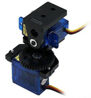
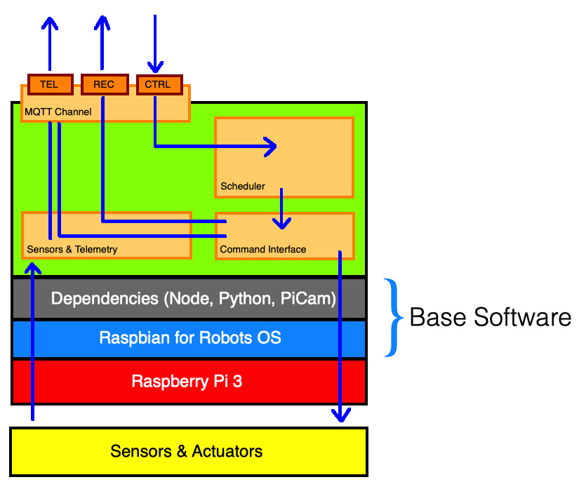

# RoboRover

----

RoboRover is a two-wheeled robot equipped with a pan/tilt camera and sensors, controlled via REST APIs through AWS IoT 
infrastructure and integrated into AWS Rekognition (object detection & classification) service.

RoboRover was originally meant to be part of an introductory course to Robotics, Machine Learning, Cloud and APIs but due
to unforseen circumstances, that is no longer the case.

Instead, I've decided to open source the entire codebase. This will serve as a great introduction to robotics, cloud, machine learning,
HTTP REST APIs, IoT and a bunch of other interesting general software engineering concepts and algorithms.

----

## Project Structure

RoboRover comes in 3 parts:

1. RoboRover base hardware
2. Roborover base software dependencies (Raspbian for Robots OS, dependencies); and
3. Application stack (Basestation UI, Infrastructure & roverOS Services)

### RoboRover Base Hardware

RoboRover is built upon an existing robotics platform from [Dexter] Industries, and can be purchased here in it's entirety: [GoPiGo3]. 
The base kit costs around `$100` and includes the most essential components (without the Raspberry Pi):

- Primary controller board
- Chassis (frame, wheels, hardware)
- Motors
- Encoders
- Power battery pack & cables

You can purchase the complete kit for `$200` that comes with additional hardware:

- Raspberry Pi 3
- Camera / Distance Sensor Mounts
- Distance Sensor
- microSD Card
- Power Supply wall adapter
- Ethernet cable

**You can buy the individual parts from the manifacturer, particularly if you have your own Raspberry Pi 3 (or 4).**

### Additional Hardware

The original kit comes only with a distance sensor, so you will have to purchase some additional hardware if you want to give your RoboRover some eyes :)

#### Pan / Tilt 2-Axis Servo Package and Pi Camera

- Raspberry Pi [Camera]

- [Servo] Motor Package

The single servo motor setup will only give your camera single axis `pan` capabilities, so if you'd like to have `tilt` capabilites too, you will
need to purchase an additional Servo Motor Package. I recommend getting a `pan\tilt` combo kit mount. Here is an example kit: [PanTiltKit]

#### Environment Sensor

If you'd like to purchase additional sensors, you may do so from Dexter Industries website. I've purchased the Temperature Humidity Pressure sensor,
and data captured will be offloaded as part of the `telemetry payload`. They have other sensors, however, you will need to extend my original code-base
and expose those measurements if you wish to do so.

### RoboRover Base Software Stack

The RoboRover software stack will be divided in few parts, but first we need to make sure that once we've assembled the RoboRover, we install all
of the dependencies required to successfully run `roverOS` services on top.

#### Raspbian for Robots Operating System

[Dexter] Industries has two different options when it comes to the Raspberry Pi's operating system for your robotics projects. RoboRover prefers
that you install Raspbian for Robots instead of DexterOS, since DexterOS is better suited to teaching and learning with "drag-and-drop" style of
programming. Raspbian, on the other hand, is more suitable for OEM-type projects, and more control of the underlying operating system.

To install Raspbian for Robots, please select either or both of the below links:

- YouTube Video: https://www.youtube.com/watch?v=1J8AAww6Ucw
- [Dexter] Industries How-To: https://www.dexterindustries.com/howto/install-raspbian-for-robots-image-on-an-sd-card/

*NOTE* You also need to make sure to configure your RoboRover to connect to your Wi-Fi network (and the internet), by configuring connectivity
settings. Please visit [Connecting] to your Raspberry Pi and configuring WiFi.

## Support

For support, please please raise a support ticket or reach out on [LinkedIn] :)

[Connecting]: https://www.dexterindustries.com/GoPiGo/get-started-with-the-gopigo3-raspberry-pi-robot/2-connect-to-the-gopigo-3/Raspbian-For-Robots-Operating-System/
[PanTiltKit]: https://www.servocity.com/spt50
[Servo]: https://shop.dexterindustries.com/shop/sensors-accessories/sensors-actuators/servo-package
[Camera]: https://shop.dexterindustries.com/shop/sensors-accessories/sensors-actuators/raspberry-pi-camera
[Dexter]: https://www.dexterindustries.com/
[GoPiGo3]: https://www.dexterindustries.com/gopigo3/
[Serverless]: https://serverless.com/
[LinkedIn]: https://www.linkedin.com/in/sasasavic/
